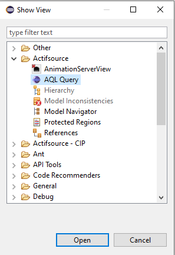
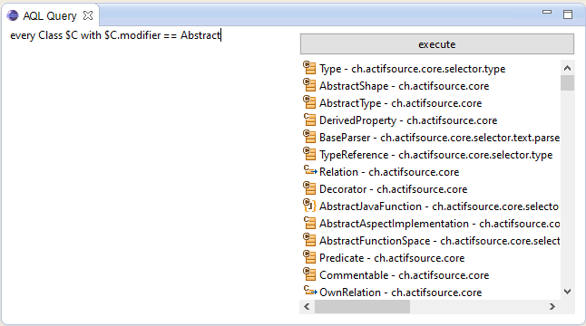

# Actifsource Query Language
The Actifsource Query Language is used to make object-oriented queries for resources. 
This makes it possible to create aspects directly in the Actifsource Editor instead of in Java. 
Queries directly on the current models in the workspace can be performed in the AQL Query View. 

# Open AQL Query View

# Query Syntax
Eine Query besteht aus einer Reihe von Definitionen, gefolgt von einer Query-Expression. Jede Definition ist eine Subquery, welche ein Zwischenresultat in einer Variable speichert. Definitionen dienen dazu, Queries übersichtlicher zu gestalten, indem die Verschachtlungstiefe reduziert wird.   
Beispiel:    

> $Super = UseProperty.subclass;    
> every Property $P with ($P.range in $Super)

Die erste Zeile ist eine Definition, welche die (direkten) Superklassen von UseProperty in der Variable $Super abspeichert. Die zweite Zeile ist dann die eigentliche Query, welche alle Properties selektiert, welche als Range eine dieser Superklassen haben. 

Die vollständige Struktur einer Query ist:    
> $Varname = Expression ;    
> $Varname = Expression ;    
> ...    
> $Varname = Expression ;    
> Expression     

Über die in einer Definition definierte Variable kann im weiteren Verlauf der Query auf das Resultat der Subquery zugegriffen werden. 

## Variablen
Eine Variable beginnt immer mit einem $-Zeichen und hat einen beliebigen alphanumerischen Namen. Jede Variable hat einen statisch inferierten Typ. Mögliche Typen sind: 

•	Ein Literal: String, Integer, Boolean     
•	Eine actifSource-Klasse: Resource, NamedResource, Class, Attribute, ...     
•	Eine Menge von Literalen oder actifSource-Klassen     

Es gibt keine Verschachtelungen von Mengen. Mengen können keine Duplikate enthalten. Alle Mengen sind geordnet, was insbesondere beim Vergleich zweier Mengen eine Rolle spielt! 

## Atomare Ausdrücke

### Literale

•	true, false    
•	Integers: 0,2,42,-5,...     
•	Strings: "Hello World",...    

Innerhalb eines Strings müssen die Zeichen " und \ escaped, also mit einem \ davor versehen werden. 

### Ressourcen
Ressourcen können mit ihrem Namen spezifiziert werden. 

### Variablen
Eine im Scope definierte Variable kann mittels $Varname referenziert werden.     
Beispiel: 

> $C = every Class;    
> $R = Resource;    
> $R in $C    

### Null    
•	null 

Steht für ein fehlendes Attribut oder Property, was es ermöglicht diese auf Vorhandensein zu prüfen: 

> ($Bar.name == null) or ($foo.range != null)

## Boolesche Ausdrücke

Vergleich zweier booleschen Ausdrücke, Negation: 

•	boolExpr == boolExpr   
•	boolExpr != boolExpr   
•	!(boolExpr)   

Logische Verknüpfung zweier booleschen Ausdrücke: 

•	boolExpr and boolExpr   
•	boolExpr or boolExpr   

## Numerische Ausdrücke

Vergleich zweier numerischen Ausdrücke: 

•	intExpr == intExpr   
•	intExpr != intExpr   
•	intExpr > intExpr   
•	intExpr < intExpr   

## Zeichenkettenausdrücke

### Vergleich zweier Zeichenketten

•	stringExpr == stringExpr   
•	stringExpr != stringExpr   

### Reguläre Ausdrücke

•	stringExpr =~ /regexp/ Prüft, ob stringExpr den regulären Ausdruck als Teilstring enthält.   
•	stringExpr ==~ /regexp/ Prüft, ob stringExpr dem regulären Ausdruck als ganzes entspricht.   

Innerhalb eines Regulären Audrucks müssen die Zeichen / und \ escaped, also mit einem \ davor versehen werden. 

## Selektionsausdrücke

### Attribut einer Ressource selektieren   
•	resourceExpr.attribute   

Ergibt ein Literal vom LiteralRange des Attributes. 

### Property einer Ressource selektieren
•	resourceExpr.property   

Je nach dem ob die Subjektkardinalität des Properties eins, oder ob sie grösser als eins ist, wird ein einzelnes Element vom Rangetyp des Properties oder eine Menge solcher Elementen selektiert. 

### Treeselect eines Properties
•	resourceExpr.property*   

Selektiert alle Objekte des Properties auf der Ressource und fügt zum Resultat wiederum alle Objekte mit dem Property hinzu, bis die gesamte Transitive Hülle<ref>http://de.wikipedia.org/wiki/Transitive_H%C3%BClle</ref> selektiert ist. Zu beachten ist, dass die Ausgangsressource selber nicht eingeschlossen ist.    

Beispiel:    
Attribute.subclass*   
Selektiert sämtliche Superklassen von Attribute.    

### Selektierung auf Mengen
Alle '.'-Selektionen können auch auf einer Menge von Ressourcen ausgeführt werden: 

•	collectionExpr.attribute   
•	collectionExpr.property   
•	collectionExpr.property*   

Das Resultat ist dann die Vereinigung aller selektierten Ressourcen ausgehend von jedem Ursprungselement. 

### Elemente nach Eigenschaft
Properties und Attribute können nicht direkt rückwärts abgefragt werden. Anstattdessen dient der folgende Ausdruck, welcher alle Ressourcen eines bestimmten Typs anhand bestimmter Eigenschaften selektiert: 

•	every classType $Varname with booleanExpr 

Dabei muss classType eine Klasse benennen. Die Variable mit angegebenem Name ist vom Klassentyp und kann innerhalb des booleschen Ausdrucks booleanExpr verwendet werden, um Bedingungen zu formulieren. Das Resultat des Ausdrucks ist die Menge aller Ressourcen vom Typ classType für welche die Bedingung booleanExpr erfüllt ist. 

Beispiele:   
> every Attribute $A with $A.literalRange == StringLiteral   
> every Property $P with ($P.range != Resource) and ($P.subjectCardinality.maxCardinality == 1)   

### Verkettung
Mehrere Selektionen können aneinandergehängt werden:    
•	resourceExpr.property.property. ... .property    

Beispiel:    
> UseProperty.subclass.property.range.name    

Selektiert die Namen von den Ranges aller Properties der Superklasse von UseProperty. 

## Mengenausdrücke
Vergleich zweier Mengen (geordnet),:    
•	collectionExpression == collectionExpression 

Erstes Element einer Menge (ergibt ein Element vom inneren Typ der Menge):    
•	first collectionExpression 

Test, ob ein Element in einer Menge vorhanden ist (ergibt ein Boolean):    
•	resourceExpr in collectionExpr 

Anzahl Elemente einer Menge (ergibt einen Integer):    
•	count collectionExpression 

## Beispiele
Alle abstrakten Klassen von denen es keine Unterklassen gibt   
> every Class $C with ($C.classModifier == Abstract)    
>                and  (count (every Class $S with $C in $S.subclass*) == 0)   
               
Zwei Bedingungen müssen für die gesuchten Klassen gelten:    
•	Die Klasse muss abstrakt sein.    
•	Es darf keine Unterklasse geben. Mit anderen Worten: Es darf keine andere Klasse geben, welche als Superklasse die gesuchte Klasse hat.    

## Requirements
Actifsource Workbench Community Edition

## License
[http://www.actifsource.com/company/license](http://www.actifsource.com/company/license)
